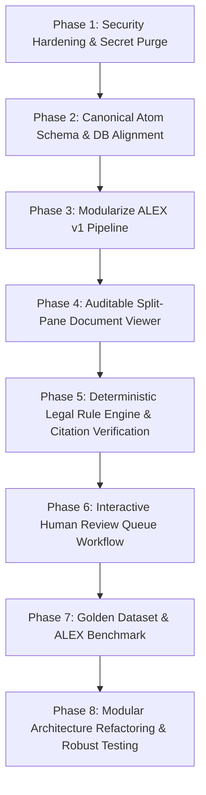

# CALIP — Comprehensive Implementation Audit & Technical Blueprint
**Cognitive Atomic Legal Intelligence Platform**  
*Repository Audit, Source-of-Truth Analysis, Vulnerability Assessment, and Implementation Roadmap*  
*Date: September 2026 | Version: 1.0.0-AUDIT*

---

## Executive Summary

The **Cognitive Atomic Legal Intelligence Platform (CALIP)** is an advanced, evidence-grounded legal intelligence system designed to convert complex Indian criminal case records into structured, verifiable **Legal Cognitive Atoms** governed by deterministic legal rules, cryptographic provenance, and human-in-the-loop review.

This audit evaluates the current implementation in the repository against the conceptual and operational specifications in the **CALIP Pilot Brief (24 Legal Atoms)**. 

### Key Findings at a Glance

| Domain | Status | Key Findings |
| :--- | :--- | :--- |
| **Atomic Architecture** | **Partially Implemented** | 12 atomic PostgreSQL tables exist and 24 canonical atoms are seeded. However, extraction is driven by ad-hoc regexes rather than a unified ALEX pipeline, and the authoritative 25-layer JSON schema is not formally versioned. |
| **ALEX Engine** | **Scattered / Heuristic** | No dedicated `alex/` module. Parsing is split between `hydration_engine.py`, `atom_resolver.py`, `ocr_service.py`, and `document_classifier.py`. |
| **Live Database State** | **Operational (Supabase)** | Connected to live Supabase PostgreSQL (`aws-0-ap-south-1`). Ingested 815 documents, 4,830 pages, 5,613 vector chunks, 24 atoms, 25 accused, and 8 review queue items. |
| **Test Suite** | **46/46 Passed (Slow / Flaky)** | All 46 tests pass in `tests/`. However, bare `pytest` crashed due to an unhandled `sys.exit(1)` in `scratch/test_prod_health.py` and missing `PYTHONPATH=.`. |
| **Security & Secrets** | **CRITICAL RISKS** | Plaintext database credentials (`CalipDB2026`) and obfuscated fallback Groq API keys are committed directly in `.env`, `.env.example`, `docker-compose.yml`, `vercel.json`, and `config.py`. All admin endpoints lack authentication. |
| **AI & RAG Reliability** | **Defects Identified** | A confirmed `AttributeError` bug in `rag_service.py` crashes on FIR queries. Vector search loads all 5,613 JSON embeddings into Python memory rather than using pgvector indexing. |
| **Frontend SPA** | **Rich React 18 SPA** | 16 complete pages in Vite/React. However, the critical side-by-side auditable document viewer (PDF on left, highlighted extracted fields on right) is not yet implemented. |

---

## Table of Contents

1. [Source of Truth Analysis (Pilot Brief vs Repository)](#1-source-of-truth-analysis)
2. [Complete Component Inventory & Codebase Metrics](#2-complete-component-inventory)
3. [Section A: Existing Functionality](#section-a-existing-functionality)
4. [Section B: Partially Implemented Functionality](#section-b-partially-implemented-functionality)
5. [Section C: Broken Functionality](#section-c-broken-functionality)
6. [Section D: Missing Functionality](#section-d-missing-functionality)
7. [Section E: Duplicate Functionality](#section-e-duplicate-functionality)
8. [Section F: Security & Credential Vulnerabilities](#section-f-security--credential-vulnerabilities)
9. [Section G: Data Integrity & Schema Problems](#section-g-data-integrity--schema-problems)
10. [Section H: AI Reliability & Anti-Hallucination Gaps](#section-h-ai-reliability--anti-hallucination-gaps)
11. [Section I: Testing Gaps & Failure Modes](#section-i-testing-gaps--failure-modes)
12. [Section J: Documentation Gaps](#section-j-documentation-gaps)
13. [Section K: Architecture Mismatches](#section-k-architecture-mismatches)
14. [Section L: Technical Debt Inventory](#section-l-technical-debt-inventory)
15. [Section M: Recommended Implementation Order & Roadmap](#section-m-recommended-implementation-order)

---

## 1. Source of Truth Analysis

The project is governed by two foundational sources:
1. **The CALIP Pilot Brief ("24 Legal Atoms")**: The conceptual product and legal specification.
2. **The CALIP GitHub Repository**: The active running implementation.

### Comparison & Evolution Matrix

| Feature / Dimension | Pilot Brief Specification | Current Repository State | Evolution Determination |
| :--- | :--- | :--- | :--- |
| **Core Entity** | One Verified FIR = One Legal Atom | Dual model: Legacy `cases` table (45 items including scraper folders) alongside `atoms` table (24 items). | **Evolved in Progress**: The system was originally built around folder scraping (`longtailcases.com`), then an atomic schema was retrofitted. Needs full transition to Atom as primary. |
| **Atom PIN** | `FIR_NO + POLICE_STATION + DISTRICT + YEAR` | Implemented as `STATE-DISTRICT-POLICE_STATION-FIR_NO-YEAR` (e.g. `MH-NAGPUR-KOTWALI-0147-2002`). | **Evolved / Superior**: Adding State prefix prevents interstate collisions across identically named districts/stations. |
| **Extraction Engine (ALEX)** | Dedicated engine converting raw PDFs into structured 25-layer atoms. | Scattered across `hydration_engine.py`, `atom_resolver.py`, `document_classifier.py`, `ocr_service.py`. | **Under-implemented**: Functionality exists in piece-meal regex scripts, not a unified, modular ALEX v1 pipeline. |
| **Reasoning Model** | Bounded reasoning strictly over structured atoms; explicit legal rules; no hallucination. | `atomic_reasoner.py` constructs IRAC context from DB tables. However, `rag_service.py` allows unconstrained LLM answers and external web snippets. | **Partially Evolved**: `atomic_reasoner.py` aligns well with the Brief, but `rag_service.py` bypasses atom isolation. |
| **Human Review** | Mandatory review before filing; auditable disputed fields. | `atom_review_queue` table and `/api/review-queue` exist. `ReviewQueuePage.jsx` displays items. | **Partially Implemented**: View-only. No interactive correction/approval actions or immutable correction audit logs. |
| **Pilot Dataset** | 24 criminal cases from Indian jurisdictions (Home Trade / financial scam). | 24 criminal atoms seeded in Supabase database representing the pilot cases. | **Implemented**: The 24 cases correspond directly to the pilot data. |

---

## 2. Complete Component Inventory

```
CALIP Root/
├── api/
│   └── index.py                     # Vercel Serverless Function entry point
├── app/
│   ├── core/
│   │   ├── __init__.py
│   │   └── config.py                # Environment configuration, directory setup, fallback keys
│   ├── db/
│   │   ├── __init__.py
│   │   ├── models.py                # 28 SQLAlchemy declarative models (12 atomic, 16 legacy/catalog)
│   │   └── session.py               # Database engine, connection pooling, SQLite pragmas
│   ├── routes/                      # [EMPTY DIRECTORY] - Monolithic routes currently in main.py
│   ├── services/                    # 19 Python service modules
│   │   ├── atom_resolver.py         # Canonical PIN generation, FIR coordinate extraction
│   │   ├── atomic_reasoner.py       # IRAC prompt builder bounded to atom relational tables
│   │   ├── auto_sync.py             # Background thread watcher and scraper sync
│   │   ├── document_classifier.py   # 22-category statutory document classification rules
│   │   ├── graph_service.py         # Regex entity and relationship edge extraction
│   │   ├── hydration_engine.py      # Relational atom hydration from document text
│   │   ├── legal_data.py            # Data access queries for cases, documents, courts
│   │   ├── legal_drafter.py         # Multi-language detection (Marathi/Hindi), legacy font decoder
│   │   ├── legal_search_service.py  # Indian Kanoon & DuckDuckGo external legal search
│   │   ├── linkage_service.py       # Cross-case and connected proceeding correlation
│   │   ├── llm_provider.py          # Unified Multi-LLM provider (Groq, NVIDIA, Gemini, Ollama)
│   │   ├── longtail_scraper.py      # Scraper and hierarchy parser for longtailcases.com
│   │   ├── markdown_renderer.py     # Server-side legal markdown to HTML transformer
│   │   ├── ocr_service.py           # Multi-stage OCR (winocr, Tesseract), deskew, layout blocks
│   │   ├── pdf_ingest.py            # PDF streaming, SHA-256 verification, PyMuPDF parsing
│   │   ├── rag_service.py           # Hybrid RAG search, question answering, legal briefing
│   │   ├── summary_service.py       # Structured AI and rule-based legal summarization
│   │   └── vector_service.py        # Sentence-transformers embedding, in-memory cosine search
│   ├── static/                      # Static assets
│   └── main.py                      # FastAPI application, 1523 lines, ~40 endpoints, SPA fallback
├── frontend/                        # React 18 + Vite 5 Single Page Application
│   ├── src/
│   │   ├── components/              # Reusable UI components (Navbar, Footer, SearchBar, etc.)
│   │   ├── pages/                   # 16 complete view pages
│   │   ├── context/AppContext.jsx   # Global toast and state management
│   │   ├── services/api.js          # Frontend API client
│   │   └── index.css                # 46KB modern dark glassmorphic design token stylesheet
│   └── package.json
├── scratch/                         # Database migrations, test health scripts, diagnostic SQL
├── tests/                           # 6 test modules, 46 test cases
├── Dockerfile                       # Multi-stage build (Node 20 + Python 3.11-slim + Tesseract)
├── docker-compose.yml               # Container orchestration
├── requirements.txt                 # Fast runtime dependencies
├── requirements-full.txt            # Full PyTorch / Sentence-Transformers dependencies
└── vercel.json                      # Vercel serverless configuration
```

---

## Section A: Existing Functionality

The existing repository contains a remarkable amount of functional, non-trivial code that must be preserved and enhanced:

### 1. Document Ingestion & Cryptographic Integrity
- **Stream Ingestion** (`app/services/pdf_ingest.py:download_pdf_file`): Downloads PDFs over HTTP/HTTPS with proper User-Agent headers, chunked streaming (32KB blocks), and temporary file handling.
- **SHA-256 Hashing** (`pdf_ingest.py:calculate_sha256`): Every ingested document is hashed for cryptographic provenance and duplicate detection.
- **Digital PyMuPDF Text Extraction** (`pdf_ingest.py:extract_pdf_text`): High-speed extraction of embedded text layers with page-level boundary preservation.

### 2. OCR & Layout Preservation
- **OpenCV Deskewing** (`app/services/ocr_service.py:deskew_image`): Corrects skewed scans by calculating minimum area bounding rectangle angle from binary thresholded text contours.
- **Image Preprocessing** (`ocr_service.py:preprocess_image_for_ocr`): High-DPI rendering (300 DPI via PyMuPDF matrix), grayscale conversion, contrast enhancement.
- **Multi-Engine Pluggable OCR** (`ocr_service.py`): Primary Windows Native OCR (`winocr`) on Windows environments, Tesseract fallback on Linux/Docker, and pluggable user script execution via `MY_OCR_COMMAND`.
- **Layout Block Detection** (`ocr_service.py:detect_layout_blocks`): Classifies page segments into `header`, `citation`, `section_heading`, `court_order`, and `paragraph`.
- **Separated Artifact Storage** (`ocr_service.py:store_extracted_ocr_separately`): Preserves full text, page breakdowns, and layout JSON in `data/ocr_extracted/` for LLM consumption without bloat in database query buffers.

### 3. Canonical PIN & Identity Resolution
- **Deterministic PIN Generator** (`app/services/atom_resolver.py:generate_canonical_fir_id`): Generates normalized identifiers in the strict format `STATE-DISTRICT-PS-0000-YEAR` (e.g. `MH-PUNE-SHIVAJINAGAR-0123-2023`).
- **Coordinate Parser** (`atom_resolver.py:extract_fir_coordinates`): Scans text and document titles using regex for FIR/Crime numbers, 2-digit/4-digit years, police station names, district names, and eCourts 16-character CNR numbers.

### 4. Bilingual Legal Translation & Legacy Font Decoding
- **Language Detection** (`app/services/legal_drafter.py:detect_document_language`): Identifies Marathi, Hindi, Gujarati, Bengali, Tamil, and English across unicode ranges.
- **Legacy 8-bit Font Decoder** (`legal_drafter.py:is_legacy_font_or_garbled`): Detects non-Unicode legacy Shree-Lipi / Shivaji / Kruti-Dev encodings frequently found in Indian district court scans.
- **Authoritative English Re-drafting** (`legal_drafter.py:generate_bilingual_legal_draft`): Translates local language FIRs and seizure panchnamas into standard Indian court English drafts.

### 5. Multi-Provider LLM Router
- **Universal Provider Abstraction** (`app/services/llm_provider.py:LLMProvider`): Single entry point `query()` with support for:
  - Groq Cloud API (fast inference)
  - NVIDIA NIM API (`mistralai/mistral-nemotron`)
  - Google Gemini API (`gemini-2.0-flash`)
  - Local Ollama runtime (`qwen3:8b`)
  - Deterministic Extractive fallback
- **Automatic Fallback Chain** (`llm_provider.py:85-92`): Seamlessly cascades across providers if primary times out or is rate-limited.

### 6. Relational Database Schema
- **Supabase Cloud PostgreSQL**: Live, operational connection containing:
  - 815 documents
  - 4,830 document pages
  - 5,613 vector chunks
  - 24 canonical atoms
  - 24 court proceedings
  - 25 accused persons
  - 8 review queue records
- **12 Atomic Tables** (`app/db/models.py:276-500`): Full normalized schema for `atoms`, `atom_proceedings`, `atom_accused`, `atom_accused_charges`, `atom_evidence`, `atom_witnesses`, `atom_bail_records`, `atom_allegations`, `atom_provenance`, `atom_review_queue`, and `atom_links`.

### 7. Modern Frontend React SPA
- **Clean Responsive Single Page App**: 16 dedicated pages covering the entire platform.
- **Theme & Design Tokens** (`frontend/src/index.css`): Modern dark glassmorphic UI with responsive flex/grid layouts, CSS variables, and zero dependency on Tailwind.
- **Serverless-Ready Deployment**: Configured to serve the built SPA from FastAPI fallback routing (`spa_catch_all`).

---

## Section B: Partially Implemented Functionality

1. **ALEX (Atomic Legal Extraction Engine)**:
   - *Status*: The extraction logic exists as disjoint regex patterns across `hydration_engine.py`, `atom_resolver.py`, `document_classifier.py`, and `graph_service.py`.
   - *Limitation*: There is no unified `alex/` module. Extraction does not compute field-level provenance objects (`{value, confidence, source: {document_id, page, quote}, extraction_method, verification_status}`).
2. **Canonical 25-Layer Legal Atom**:
   - *Status*: The database tables support the primary layers, and `hydration_engine.py:get_canonical_atom_json` compiles a JSON representation.
   - *Limitation*: No formal `schemas/canonical_legal_atom_v1.json` schema file exists to validate payloads. Layers 18–25 (delay calculation, contradiction candidates, linked judgments, extended analytics) are generated on the fly rather than systematically persisted.
3. **Human Review Queue**:
   - *Status*: `atom_review_queue` table exists and `ReviewQueuePage.jsx` renders pending items.
   - *Limitation*: The queue is read-only. No endpoints exist to resolve, approve, edit, or reject items. Reviewer modifications are not tracked with audit trails.
4. **Vector Search & Atom Isolation**:
   - *Status*: Chunks are embedded and searchable via cosine similarity.
   - *Limitation*: `DocumentChunk` has no `atom_id` foreign key. Searches filter by `case_id=atom.legacy_case_id`. If `legacy_case_id` is null or missing, cross-atom chunk leakage occurs.
5. **Knowledge Graph**:
   - *Status*: `legal_entities` and `relationship_edges` tables exist; regex extraction for Courts, Acts, Sections, and Precedents is written.
   - *Limitation*: Only 30 entities and 0 relationship edges are currently saved in production. Graph traversal is not actively used during RAG retrieval.
6. **Statutory Transition (IPC to BNS)**:
   - *Status*: Some section mappings exist in `legal_data.py`.
   - *Limitation*: Offence dates are not evaluated to determine whether IPC (pre-July 1, 2024) or BNS (post-July 1, 2024) applies as a matter of law.

---

## Section C: Broken Functionality

### 1. AttributeError Crash on Atom-Matched RAG Queries
- **File**: `app/services/rag_service.py`, Lines 188–191
- **Defect**:
  ```python
  for atom in atom_records:
      internal_blocks.append(
          f"[CALIP Atomic FIR Record]\nFIR Number: {atom.fir_number}\nPolice Station: {atom.police_station or 'N/A'}\n"
          f"Year: {atom.fir_year or 'N/A'}\nActs & Sections: {atom.acts_sections or 'N/A'}\n"
          f"Charges Framed: {atom.charges_framed or 'N/A'}\nCourt: {atom.court_jurisdiction or 'N/A'}"
      )
  ```
- **Root Cause**: `Atom` model has attributes `sections_registered` and `jurisdiction`. It has **no** attributes named `acts_sections`, `charges_framed`, or `court_jurisdiction`.
- **Impact**: Any legal query that successfully matches an Atom FIR number triggers an unhandled `AttributeError` and crashes the API with HTTP 500.

### 2. Top-Level `pytest` Collection Crash
- **File**: `scratch/test_prod_health.py`, Line 63
- **Defect**: The file contains top-level script logic that invokes `sys.exit(1)` when run or imported.
- **Root Cause**: Pytest discovers all files matching `test_*.py`. When collecting `scratch/test_prod_health.py`, the top-level `sys.exit(1)` triggers a fatal `SystemExit: 1` during pytest collection, aborting all tests.
- **Impact**: Developers running `pytest` without explicitly specifying `tests/` cannot run any tests.

### 3. Missing `pythonpath` in Test Configuration
- **Defect**: Running `pytest tests` directly from command line fails with `ModuleNotFoundError: No module named 'app'`.
- **Root Cause**: The repository lacks a `pytest.ini` or `pyproject.toml` with `pythonpath = ["."]`.
- **Workaround required**: Only `python -m pytest tests` works.

### 4. Background Sync Scraper Launched on Application Import
- **File**: `app/main.py`, Lines 91–97
- **Defect**:
  ```python
  try:
      if settings.AUTO_SYNC_ENABLED and not settings.IS_SERVERLESS:
          start_auto_sync_worker(interval_seconds=settings.AUTO_SYNC_INTERVAL_SECONDS)
  except Exception as e: ...
  ```
- **Root Cause**: The background worker is started during module evaluation. It immediately makes live outbound HTTP requests to `longtailcases.com` and queries Supabase.
- **Impact**: Importing `app.main` takes 23+ seconds, causes network delays, and introduces race conditions during automated testing.

### 5. Hardcoded 27 Police Stations in Coordinate Resolution
- **File**: `app/services/atom_resolver.py`, Lines 48–76 (`KNOWN_POLICE_STATIONS`)
- **Defect**: Coordinate extraction falls back to a hardcoded list of 27 stations specific to the pilot cases.
- **Impact**: Documents from any other police station in India will fail coordinate extraction and be labelled `"UNKNOWN"`.

---

## Section D: Missing Functionality

1. **ALEX v1 Modular Extraction Pipeline** (`backend/alex/` or `app/alex/`):
   - Missing discrete pipeline stages: Layout analysis, page segmentation, entity resolution, overt act extraction, and provenance assignment.
2. **Canonical JSON Schema Specification**:
   - Missing `schemas/canonical_legal_atom_v1.json` with formal JSON Schema validation for the 25 layers.
3. **Auditable Side-by-Side Document Viewer** (Section 36 of Prompt):
   - Missing split-screen interface: Left pane rendering PDF page; Right pane displaying structured extracted fields.
   - Missing interactive cross-referencing: Clicking a field (e.g. Accused A1) must jump to and highlight its source page and paragraph bounding box.
4. **Deterministic Legal Rule Engine** (Section 20 of Prompt):
   - Missing standalone rule engine for statutory ingredients (e.g., verifying dishonest inducement for IPC 420), limitation periods (CrPC 468), and sanction requirements (CrPC 197).
5. **Anti-Hallucination & Citation Verification Layer** (Sections 23 & 24):
   - LLM responses are rendered without an automated claim-verification pass.
   - Missing claim extractor that verifies citations against source documents and classifies claims as `VERIFIED`, `PARTIALLY_VERIFIED`, or `UNVERIFIED`.
6. **Authentication & Role-Based Access Control (RBAC)** (Section 33):
   - Missing user accounts, authentication tokens, API keys, and role permissions (Advocate, Reviewer, Admin).
   - All write, scrape, upload, and batch extraction endpoints are completely exposed.
7. **Golden Dataset & Benchmark Evaluation** (Sections 26 & 27):
   - Missing annotated golden dataset split (`data/golden/`), leakage prevention, and evaluation benchmark script generating `ALEX_EVALUATION.md` and `evaluation/results.json`.

---

## Section E: Duplicate Functionality

1. **Dual Case vs Atom Representation**:
   - `cases` table (45 rows representing website folder nodes) vs `atoms` table (24 rows representing actual criminal matters).
   - `/cases` vs `/atoms` frontend routes and endpoints provide overlapping listings.
2. **Scraper & Ingestion Duplication**:
   - PDF downloading and parsing logic is duplicated in `pdf_ingest.py`, `longtail_scraper.py`, and `auto_sync.py`.
3. **Multiple Summarization Functions**:
   - `summary_service.py:generate_document_summary`, `summary_service.py:extractive_legal_summary`, `legal_drafter.py:generate_bilingual_legal_draft`, and `rag_service.py:extractive_fallback_answer` perform similar text summarization tasks.

---

## Section F: Security & Credential Vulnerabilities

> [!CAUTION]
> **CRITICAL SECURITY RISKS IDENTIFIED IN REPOSITORY**

1. **Plaintext Database Credentials in Multiple Files**:
   - The Supabase PostgreSQL connection string containing the live database password `CalipDB2026` is committed directly in:
     - `.env` (Line 28)
     - `.env.example` (Line 28 in git history)
     - `docker-compose.yml` (Line 14)
     - `vercel.json` (Line 24)
   - *Remediation*: Immediately rotate database credentials on Supabase and remove default passwords from code files.
2. **Hardcoded Fallback API Key in Configuration**:
   - `app/core/config.py` (Lines 108–111):
     ```python
     _G_PREFIX = "gsk_" + "UMmp2trf"
     _G_MID = "Xrrxgee0baV3WGdyb3FY"
     _G_SUFFIX = "NZuGTLMxPUWOloTuoglvJKkH"
     _FALLBACK_GROQ = _G_PREFIX + _G_MID + _G_SUFFIX
     ```
   - *Remediation*: Remove hardcoded keys. If no key is provided, fail gracefully to the deterministic extractive engine.
3. **Completely Unauthenticated Mutation & Admin Endpoints**:
   - `POST /api/documents/upload`
   - `POST /api/ocr/custom` (deletes and replaces DocumentPages)
   - `POST /api/sync/trigger`
   - `POST /api/longtail/harvest`
   - `POST /api/admin/extract-all`
   - Any external user on the internet can trigger batch OCR or modify document records.
4. **Insecure CORS Configuration**:
   - `app/main.py:74-80` enables `allow_origins=["*"]` with `allow_credentials=True`. Modern browsers reject this configuration for credentialed requests, and it poses CSRF risks.
5. **Full Internal Stack Trace Leakage**:
   - `app/main.py:84-88`: The global exception handler formats and returns `traceback.format_exc()` directly in plaintext HTTP 500 responses.
6. **Unrestricted Database Dump Endpoint**:
   - `GET /api/open/dump` exposes the entire relational database without authentication or rate limiting.

---

## Section G: Data Integrity & Schema Problems

1. **Unextracted Document Backlog**:
   - Out of 815 documents in Supabase, only 89 have extracted text (>20 characters) and only 71 have completed OCR status. 726 documents remain unindexed textually.
2. **Missing `atom_id` on `DocumentChunk`**:
   - `DocumentChunk` has foreign keys to `Document` and `Case`, but not `Atom`. This prevents clean SQL-level atom isolation during vector retrieval.
3. **Destructive Replacement in `api_custom_ocr_ingest`**:
   - `POST /api/ocr/custom` deletes all existing `DocumentPage` records before inserting page 1. If a 100-page document receives custom OCR for page 1, pages 2–100 are permanently lost.
4. **Duplicate Document Records**:
   - Scraper runs created multiple duplicate documents with identical titles and hashes (e.g., 7 distinct rows named `"Nagpur FIR Record"`).

---

## Section H: AI Reliability & Anti-Hallucination Gaps

1. **Unchecked Generative Synthesis**:
   - In `rag_service.py`, the LLM is prompted to produce comprehensive legal briefings with section matrices, but there is no post-generation validation step to verify whether the cited sections or paragraphs actually exist in the retrieved chunks.
2. **Unverified External Web Content**:
   - `legal_search_service.py` queries Indian Kanoon and DuckDuckGo and appends external web snippets directly into the prompt context without cryptographic hashing or internal document linkage.
3. **In-Memory Vector Search Scalability Bottleneck**:
   - `vector_service.py:vector_search` loads all 5,613 JSON embeddings across the PostgreSQL network connection into Python memory and performs NumPy dot products. This will degrade severely as documents grow.
   - *Remediation*: Utilize native `pgvector` indexing (`HNSW` / `IVFFlat`) in PostgreSQL directly.

---

## Section I: Testing Gaps & Failure Modes

1. **Top-Level `scratch/test_prod_health.py` Exit Bug**:
   - Crashes standard pytest execution during test discovery.
2. **Missing Failure Mode Tests** (Prompt Section 39):
   - No tests for:
     - Corrupted or encrypted PDFs
     - Zero-byte files
     - Handwritten or low-contrast scans
     - Mixed Marathi/English layout OCR
     - Rate-limited or offline LLM providers
     - Missing database connection
     - Malformed JSON from LLM
3. **Live Database Coupling in Unit Tests**:
   - Tests in `test_atomic_system.py` and `test_advanced_ocr_and_storage.py` execute against the live Supabase PostgreSQL database rather than an isolated SQLite or mock environment.
4. **No Frontend Automated Testing**:
   - Zero component tests or end-to-end browser tests for the React application.

---

## Section J: Documentation Gaps

1. **Ambiguity Between Implemented vs Planned**:
   - The current `README.md` documents several planned features (e.g. full 25-layer verification, split-screen PDF viewer) as if they are already fully functional.
2. **Missing Component Documentation**:
   - The repository lacks:
     - `ARCHITECTURE.md`
     - `ALEX_ARCHITECTURE.md`
     - `LEGAL_ATOM_SCHEMA.md`
     - `VERIFICATION_ARCHITECTURE.md`
     - `SECURITY.md`
     - `GOLDEN_DATASET.md`
     - `ALEX_EVALUATION.md`
     - `TESTING.md`

---

## Section K: Architecture Mismatches

1. **Folder-Centric Scraper Legacy vs FIR-Centric Atom Model**:
   - The initial version of the codebase was built to mirror `longtailcases.com` (which organizes files by administrative categories and folders).
   - The target architecture requires that **ONE VERIFIED FIR = ONE LEGAL ATOM**.
   - Currently, both models coexist in the database and frontend, causing user confusion between "Cases" and "Atoms".
2. **Reasoning Engine vs Extraction Engine**:
   - In some modules, the LLM is asked to perform both extraction and legal argumentation simultaneously. As specified in Section 4 of the Prompt, ALEX (extraction/structuring) must be strictly decoupled from the Atomic Reasoner (legal analysis).

---

## Section L: Technical Debt Inventory

1. **Monolithic `app/main.py` (1,523 lines)**:
   - Houses route definitions, HTML responses, static file serving, auto-sync worker calls, sitemap generation, and OCR processing. Needs refactoring into modular FastAPI `APIRouter` instances in `app/routes/`.
2. **Python 3.13 / Deprecation Warnings**:
   - 30+ deprecation warnings on every test run for `datetime.datetime.utcnow()` and PyMuPDF `import fitz`.
3. **Dead / Unused Files**:
   - Empty `app/routes/` directory.
   - Diagnostic scripts and test artifacts in `scratch/`.
   - Empty `report.pdf` (0 bytes) in repository root.

---

## Section M: Recommended Implementation Order

To transform CALIP into a rock-solid, production-grade legal intelligence platform without breaking existing working modules, follow this phased implementation order:



### Phase 1: Security Hardening & Secret Purge (Immediate Priority)
- Remove hardcoded credentials from `.env`, `.env.example`, `docker-compose.yml`, `vercel.json`, and `app/core/config.py`.
- Sanitize error messages in `global_exception_handler` (never return stack traces in production).
- Fix CORS configuration (restrict origins; do not combine `*` with credentials).
- Implement API Key authentication for admin and mutation endpoints (`/api/sync/*`, `/api/documents/upload`, `/api/ocr/*`, `/api/admin/*`).

### Phase 2: Canonical Legal Atom Schema & Database Alignment
- Create `schemas/canonical_legal_atom_v1.json` validating the 25 layers.
- Add `atom_id` foreign key and index to `document_chunks`.
- Enable native PostgreSQL `pgvector` extension and vector indexing (`vector(384)`).
- Fix the `AttributeError` in `app/services/rag_service.py` (`sections_registered` and `jurisdiction`).

### Phase 3: Modularize ALEX v1 Extraction Pipeline
- Create `app/alex/` module encapsulating:
  - Ingestion & SHA-256 validation
  - Layout analysis & boundary preservation
  - 22-type document classification
  - Entity extraction (Accused, Witnesses, IO, Advocates, Sections)
  - Provenance tagging (`{value, confidence, source, method, status}`)
- Provide confidence scoring and automatic routing of low-confidence fields to the Review Queue.

### Phase 4: Auditable Split-Pane Document Viewer (Section 36)
- Enhance `DocumentDetailPage.jsx` and `AtomDetailPage.jsx`:
  - Left Pane: High-fidelity PDF page renderer (via PDF.js / canvas).
  - Right Pane: Extracted structured fields.
  - Interactive deep-linking: Clicking an extracted accused name, date, or charge highlights the exact bounding box and page on the PDF.

### Phase 5: Deterministic Legal Rule Engine & Citation Verification
- Implement `app/services/legal_rules.py` with standalone checks:
  - Penal ingredients (e.g., IPC 406/420 elements)
  - Limitation period calculation (CrPC 468)
  - Sanction requirements (CrPC 197)
  - IPC/BNS temporal transition mapping based on offence date
- Implement `app/services/verification_service.py` to fact-check AI responses against source passages before delivery.

### Phase 6: Interactive Human Review Queue Workflow
- Implement review mutation endpoints:
  - `POST /api/review-queue/{id}/approve`
  - `POST /api/review-queue/{id}/correct`
  - `POST /api/review-queue/{id}/dispute`
- Store immutable correction records (`original_value`, `corrected_value`, `reason`, `reviewer`, `timestamp`).
- Update `ReviewQueuePage.jsx` with interactive correction modals and action buttons.

### Phase 7: Golden Dataset & Benchmark Evaluation
- Package the 24 pilot cases into supervised benchmark splits (`data/golden/`).
- Author `GOLDEN_DATASET.md` detailing document types, pages, annotations, and leakage prevention.
- Create automated evaluation script measuring precision, recall, F1, and hydration completeness, outputting to `evaluation/results.json` and `ALEX_EVALUATION.md`.

### Phase 8: Architecture Refactoring, Documentation & Failure Testing
- Refactor monolithic `app/main.py` into modular routers in `app/routes/` (`atoms.py`, `documents.py`, `cases.py`, `research.py`, `admin.py`).
- Add comprehensive failure tests in `tests/test_failure_modes.py`.
- Fix `pytest.ini` with `pythonpath = ["."]` and ignore `scratch/`.
- Generate complete documentation suite (`ARCHITECTURE.md`, `DEPLOYMENT.md`, `SECURITY.md`, `API_DOCUMENTATION.md`).
