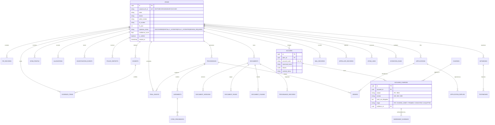
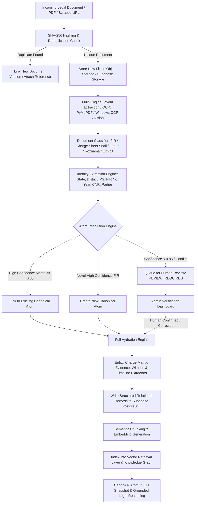
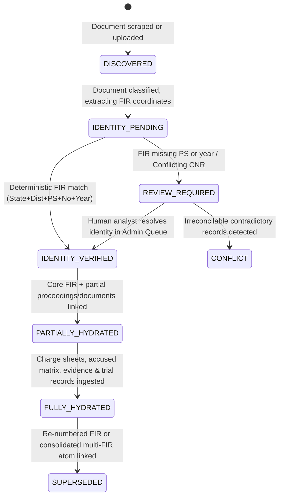
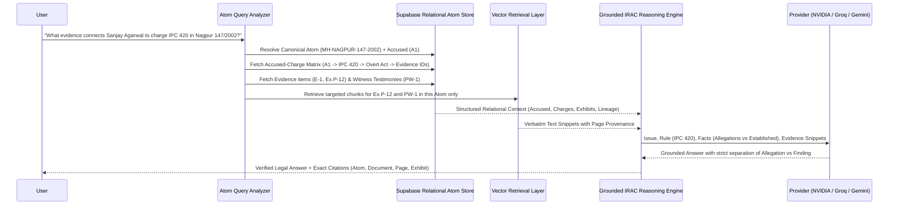

# CALIP: ATOM-CENTRIC LEGAL INTELLIGENCE PLATFORM
## Comprehensive Architectural Audit, Target Blueprint, and Relational Specification

---

### Executive Architectural Directive

> **ONE VERIFIED FIR = ONE LEGAL COGNITIVE ATOM**
>
> An atom represents exactly one verified FIR-based criminal matter. It is identified canonically by:
> `STATE / JURISDICTION` + `DISTRICT` + `POLICE STATION` + `FIR NUMBER` + `FIR YEAR` (e.g., `MH-PUNE-SHIVAJINAGAR-0123-2023`), paired with an immutable internal UUID.
>
> Court proceedings, CNR numbers, charge sheets, bail applications, trial orders, exhibits, witness testimonies, High Court petitions, and Supreme Court rulings are **progeny and components of this single atom**. They do **not** form independent atoms.

---

## 1. Current Architecture Report

### 1.1 Existing Component Inventory & Technology Stack

| Layer | Current Implementation | Status & Limitations |
| :--- | :--- | :--- |
| **Framework & Runtime** | Python 3.13.13, FastAPI (v0.141.1), Starlette, Uvicorn | Solid modern async ASGI web layer. Fully reusable. |
| **Database** | **Supabase Cloud PostgreSQL** (`db.qmnzsgnompkfdqtdadhy.supabase.co:5432/postgres`) | Live & connected. Relational schema exists but is flat/case-centric. |
| **ORM & Data Access** | SQLAlchemy 2.0 (`SessionLocal`, declarative base) | Clean ORM setup, connection pool functional, needs atomic migrations. |
| **Upstream Data Source** | `longtailcases.com` scraper (`BeautifulSoup4`, `requests`) | Scrapes folder tree into `cases` & `longtail_folders` tables. |
| **Document Ingestion** | `pdf_ingest.py`, `tempfile`, PyMuPDF (fitz) | Downloads PDFs, computes SHA-256 hash, parses text/pages. |
| **OCR Pipeline** | `ocr_service.py`, Windows native OCR (`winocr`), OpenCV deskew, Tesseract | Dual text extraction + OCR fallback. Stores text in DB and temp files. |
| **Embeddings & Vector** | `vector_service.py`, `sentence-transformers` (`all-MiniLM-L6-v2`), JSON column | Stores 384-dim vector in `document_chunks.embedding` JSON. |
| **LLM Inference** | `llm_provider.py` (Groq, NVIDIA NIM, Gemini, Ollama, Deterministic fallback) | Flexible multi-provider abstraction with fallback chain. Fully reusable. |
| **RAG Retrieval** | `rag_service.py` (Hybrid vector search + metadata filters) | Retrieves raw text chunks, sends unstructured prompt to LLM. |
| **Knowledge Graph** | `graph_service.py` (`legal_entities`, `relationship_edges`) | Simple entity extraction via regex (Court, Act, Section, Precedent). |
| **Frontend UI** | Jinja2 templates, Vanilla CSS design tokens (`base.css`), Vanilla JS | Dark-themed, responsive dashboard, tabs, modal, search. |
| **Deployment** | Vercel Serverless (`api/index.py`, `@vercel/python`, `vercel.json`) | Configured with 60s timeout, serverless flags. |

### 1.2 Live Supabase Database Audit

Live inspection of the Supabase PostgreSQL database revealed:
- **`cases` (45 rows)**: Critical architectural defect — website categories (e.g., `lt-34 GROUP ORDERS`, `lt-36 Transfer Petition`, `mis-MIS.pdf`) are stored as "cases". Only ~24 rows represent actual criminal matters.
- **`documents` (792 rows)**: 627 documents are labelled generic `"Document"`. 133 are `"Application / Order"`, 16 `"Order"`, 9 `"FIR"`, 5 `"Investigation Report"`, 1 `"ChargeSheet"`.
- **`document_pages` (3,537 rows)**: OCR and native page-level text extraction stored directly in PostgreSQL.
- **`document_chunks` (4,350 rows)**: Chunked text and vector representations.
- **`longtail_folders` (334 rows)**: Hierarchical folder structure mirrored from the upstream website.
- **`courts` (38 rows)**: Court directory.
- **`legal_entities` (30 rows)** & **`relationship_edges` (0 rows)**: Entity layer initialized but largely unpopulated.
- **`judgments` (0), `orders` (0), `applications` (0), `acts` (0), `sections` (0)**: Tables exist in schema but are currently empty because documents were not classified into these structured entities.

---

## 2. Target CALIP Atomic Architecture

### 2.1 Conceptual Hierarchy

```
CALIP LEGAL INTELLIGENCE SYSTEM
│
├── Canonical Legal Cognitive Atom (One Verified FIR)
│   ├── Canonical FIR Identity: STATE-DISTRICT-POLICE_STATION-FIR_NO-FIR_YEAR
│   ├── Core FIR Allegation Record (Source Text, Translations, Sections, Informant)
│   ├── Procedural Lineage (FIR → Magistrate → Sessions → High Court → Supreme Court)
│   ├── Entities & Roles (Accused A1..An, Complainant, Witnesses PW1..PWn, IO, Judge)
│   ├── Police Investigation Chronology (Panchnamas, Seizures, Forensic, Remands)
│   ├── Police Final Reports (Charge Sheets, Supplementary Reports, Section Evolution)
│   ├── Accused → Charge → Evidence Matrix (A1 → IPC/BNS → Overt Act → Ex.P-1 → Outcome)
│   ├── Documentary & Digital Evidence Registry (E1..En, Chain of Custody, Hashes)
│   ├── Witness Testimonies & Contradictions (PW statements, 161/164, Depositions)
│   ├── Exhibits & Material Objects (Ex.P-1..Pn, Ex.D-1..Dn, MO-1..MOn)
│   ├── Applications, Bail Track & Chronological Trial Record (CrPC 437/439/438, 313 Statements)
│   ├── Appellate Record (High Court & Supreme Court Petitions, Orders, Rulings)
│   ├── Precedents & Legal Ingredients (Ratio Decidendi, Statutory Ingredients)
│   └── Provenance Ledger (Source URL, Hash, Page, Confidence, Verification Status)
│
├── Atom Resolution Engine (Multi-stage deterministic & probabilistic classifier)
├── Full Hydration Pipeline (Asynchronous, idempotent, checkpointed)
├── Supabase PostgreSQL Relational Schema (Normalized tables, strict foreign keys)
├── Evidence-Grounded Hybrid RAG & Reasoning Engine (IRAC, provenance citations)
└── Atom-Centric Dashboard & Admin Verification Queue
```

---

## 3. Database ER Diagram

The normalized PostgreSQL schema replaces the flat case representation with a 28-table atomic relational model.



---

## 4. Data Flow Diagram



---

## 5. Atom Lifecycle Diagram



---

## 6. Document Ingestion Pipeline

Every incoming document undergoes strict, immutable processing:

1. **Acquisition & Hashing**:
   - Stream incoming binary; calculate cryptographic `SHA-256`.
   - Check `documents.file_hash`. If identical hash exists, avoid redundant OCR; link document record to new source/proceeding.
2. **Immutability & Object Storage**:
   - Store unmodified binary in Supabase Storage / S3-compatible blob storage with key `atoms/{atom_id}/docs/{sha256}.pdf`.
   - Never overwrite existing files. If a new version arrives, create a `document_versions` row.
3. **Text & Layout Extraction**:
   - Primary: High-speed PyMuPDF text extraction. If page character density < 80 chars/page, mark `ocr_required = True`.
   - Secondary / OCR: Native Windows OCR (`winocr`) or OpenCV deskew + Tesseract / Custom user OCR hook (`MY_OCR_COMMAND`).
   - Extract bounding boxes, headers, footers, stamps, and page numbers.
4. **Document Classification**:
   - Run multi-feature classifier across title, structure, and text content (see Part 7).
5. **Identity Extraction**:
   - Extract State, District, Police Station, Crime/FIR Number, Year, CNR, Court, and Parties.
6. **Atom Resolution**:
   - Match or create canonical atom (see Part 8).

---

## 7. Document Classification Engine

The document classifier does **not** rely solely on filenames. It analyzes text keywords, court headings, and structural markers.

### Classified Document Types & Recognition Criteria

```
FIR / CRIME REPORT:
  Keywords: "First Information Report", "Form No. 24.5(1)", "U/s 154 Cr.P.C.", "Prathama Khabar"
  Extracts: Police Station, Crime No, FIR Year, Sections, Informant, Occurrence Date

CHARGE SHEET / FINAL REPORT:
  Keywords: "Final Report under Section 173 Cr.P.C.", "Police Report", "Doshrop Patra"
  Extracts: Court of Cognizance, Accused Charge Matrix, Witness List (LW1..LWn), Seized Properties

BAIL APPLICATION & ORDER:
  Keywords: "Section 437/439 Cr.P.C.", "Bail Application", "Anticipatory Bail U/s 438", "Interim Bail"
  Extracts: Applicant, Custody Period, Objections, Decision (Granted/Rejected), Conditions

ROZNAMA / DAILY ORDER SHEET:
  Keywords: "Roznama", "Daily Board", "Order Sheet", "Proceeding of the Court"
  Extracts: Hearing Date, Presiding Judge, Business Transacted, Next Date of Hearing (NDOH)

WITNESS STATEMENT & DEPOSITION:
  Keywords: "Statement under Section 161 Cr.P.C.", "Deposition of PW", "Examination-in-Chief", "Cross-Examination"
  Extracts: Witness Name, PW/DW Number, Omissions, Contradictions, Exhibits marked

JUDGMENT:
  Keywords: "In the Court of", "Sessions Case No", "Criminal Appeal", "Judgment", "Held", "Operative Order"
  Extracts: Author Judge, Ratio Decidendi, Findings on Charges, Conviction/Acquittal, Sentence
```

The classifier returns:
```json
{
  "document_type": "CHARGE_SHEET",
  "confidence": 0.96,
  "classification_method": "regex_structural_heading_ensemble",
  "classification_timestamp": "2026-09-25T11:00:00Z"
}
```

---

## 8. Atom Resolution Engine

The Atom Resolution Engine answers the 18 critical questions for every document:

```
DOCUMENT
   │
   ├── 1. Classify Type (e.g., FIR, Charge Sheet, Bail Order)
   ├── 2. Extract FIR Coordinates: [State, District, Police Station, Number, Year]
   ├── 3. Canonical FIR Identity Synthesis:
   │      Format: {STATE}-{DISTRICT}-{POLICE_STATION}-{FIR_NO}-{YEAR}
   │      Example: MH-PUNE-SHIVAJINAGAR-0123-2023
   │
   ├── 4. Matching Algorithm:
   │      a. Exact Canonical ID match against `atoms` table -> MATCHED
   │      b. CNR match across `proceedings` table -> Link to parent Atom
   │      c. Court Case No + Court Name lookup -> Link to proceeding
   │      d. Incomplete FIR details (e.g. number exists, PS missing) -> REVIEW_REQUIRED
   │      e. Completely novel verified FIR -> New Canonical Atom (IDENTITY_VERIFIED)
   │
   └── 5. Decision Gate:
          Confidence >= 0.85 & Valid Coordinates: Commit to Atom
          Confidence < 0.85 or Conflicts: Emit to Admin Verification Queue
```

---

## 9. Full Atom Hydration Specification (Layers 01–25)

The hydration pipeline populates 25 structured layers:

1. **Atomic Identity**: Canonical FIR ID, State, District, Police Station, FIR No, FIR Year, Registration Date, Occurrence Date/Time, Place, Informant, Original Language (Marathi/Gujarati/Hindi), English translation, Sections as registered, Source hash.
2. **Proceeding Lineage**: Tracks complete case genealogy:
   `FIR → Remand Magistrate → Regular Magistrate → Sessions Court → High Court → Supreme Court`.
   Stores CNR, Court tier, Presiding Judge, Case numbers across tiers.
3. **People & Roles**: Accused (A1..An), Complainant, Informant, Victim, IO, Witnesses (PW1..PWn, DW1..DWn), Defense Counsel, Prosecutor. Role validity periods and deduplication.
4. **FIR Allegations**: Granular decomposition of allegations with status labels: `ALLEGED`, `TESTIFIED`, `SUBMITTED`, `ESTABLISHED`, `DISPUTED`, `REJECTED`. Traceable to page and paragraph.
5. **Investigation Chronology**: Panchnamas, Seizures, Search warrants, Forensic requests/reports, IO transfers, Arrests, Remands.
6. **Police Reports**: Charge sheet filing dates, cognizance dates, section evolution tracking (`FIR sections` → `Charge-sheet sections` → `Framed charges` → `Verdict`).
7. **Accused → Charge Matrix**: Critical relational mapping:
   `ACCUSED (A1) → STATUTE/SECTION (IPC 420) → OVERT ACT → EVIDENCE (Ex.P-12) → STAGE (Framed) → VERDICT (Pending)`.
8. **Disclosure & Completeness**: Tracking supplied (CrPC 207), missing, disputed, uncertified, or translation-requested records. Absence of document ≠ proof of non-existence.
9. **Documentary Evidence**: Contracts, bank statements, ledgers, audit notes, correspondence with exhibit numbers, custodians, and verification hashes.
10. **Digital & Forensic Evidence**: CDRs, emails, hard drive mirrors, hash values, Section 65B BSA certificates, chain of custody.
11. **Witness Evidence**: Statements (CrPC 161, 164), chief examination, cross-examination, contradictions, omissions, hostility declarations.
12. **Exhibits & Material Objects**: Exhibit numbering (`Ex.P-1`, `Ex.D-1`, `MO-1`), tied to testifying witnesses and custody records.
13. **Trial Record**: Chronological event stream from cognizance, committal, charge framing, 313 CrPC statement, final arguments, to judgment.
14. **Applications & Replies**: Substantive filings: Application → Grounds → Prosecution Reply → Judicial Order → Compliance.
15. **Bail Track**: Per-accused, per-attempt bail ledger (CrPC 437, 439, 438, Default Bail 167(2), Interim Bail, Custody days, Conditions imposed).
16. **High Court / Supreme Court**: Appellate lineage, petitions, SLPs, interim stay orders, judgments broken into Issues, Arguments, Ratio, and Obiter.
17. **Related Litigation**: Typed bidirectional relationships: `same_transaction`, `cross_fir`, `counter_fir`, `companion_case`, `co_accused_separate_trial`.
18. **Authorities & Precedents**: Cited rulings with court, year, citation, proposition, and treatment (`followed`, `distinguished`, `overruled`).
19. **Issues & Reasoning**: Separation of `FACT`, `ALLEGATION`, `TESTIMONY`, `SUBMISSION`, and `JUDICIAL FINDING`.
20. **Financial / Event Graph**: Actor → Event → Account → Transaction → Amount → Document.
21. **Provenance & Quality**: Every extracted fact retains `source_document_id`, `page_number`, `paragraph`, `extraction_model`, `confidence_score`, `verified_by`.
22. **Access & Safeguards**: Sealed document flags, PII masking, POCSO/victim protection controls, audit logging.
23. **Model-Ready Representation**: Clean paired texts (original regional language + English translation), entity normalization, chunk vectors.
24. **Training / Evaluation**: Data splits strictly partitioned by **Atom/FIR**, never by document, preventing data leakage across train/validation/test sets.
25. **Operations & Freshness**: Idempotent checkpointing, review queues, pipeline run tracking, time-stamped canonical snapshots.

---

## 10. Canonical Atom JSON Specification

```json
{
  "atom_id": "c1f7b9e0-8a21-4f1b-9e4a-5b6d7e8f9a0b",
  "canonical_fir_id": "MH-PUNE-SHIVAJINAGAR-0123-2023",
  "hydration_status": "PARTIALLY_HYDRATED",
  "confidence_score": 0.98,
  "identity": {
    "fir_number": "123",
    "fir_year": 2023,
    "police_station": "Shivajinagar",
    "district": "Pune",
    "state": "Maharashtra",
    "jurisdiction": "Judicial Magistrate First Class, Pune",
    "registration_date": "2023-04-12",
    "occurrence_date": "2023-04-10",
    "sections_registered": ["IPC 420", "IPC 406", "IPC 120B"]
  },
  "case_lineage": [
    {
      "tier": "MAGISTRATE",
      "court": "JMFC Pune",
      "case_number": "CC/456/2023",
      "cnr": "MHPU020012342023",
      "status": "COMMITTED"
    },
    {
      "tier": "SESSIONS",
      "court": "Sessions Court, Pune",
      "case_number": "SC/89/2023",
      "cnr": "MHPU010043212023",
      "status": "TRIAL_IN_PROGRESS"
    }
  ],
  "accused": [
    {
      "accused_id": "acc-1",
      "code": "A1",
      "canonical_name": "Sanjay Agarwal",
      "aliases": ["Sanjay Kumar Agarwal"],
      "custody_status": "BAIL_GRANTED"
    }
  ],
  "accused_charges": [
    {
      "accused_id": "acc-1",
      "statute": "IPC 1860",
      "section": "420",
      "overt_act": "Alleged misrepresentation in investment bonds issuance",
      "stage": "CHARGE_FRAMED",
      "supporting_evidence": ["E-1", "E-4"],
      "supporting_witnesses": ["PW-1"]
    }
  ],
  "bail_records": [
    {
      "accused_id": "acc-1",
      "court": "Sessions Court, Pune",
      "application_no": "BA/124/2023",
      "order_date": "2023-08-15",
      "outcome": "GRANTED",
      "conditions": "Surrender passport; report every Monday to PS"
    }
  ],
  "evidence": [
    {
      "evidence_id": "E-1",
      "category": "DOCUMENTARY",
      "title": "Bond Agreement dated 12-01-2002",
      "exhibit_no": "Ex.P-12",
      "custodian": "Complainant Bank",
      "source_document_id": "doc-Documents_1768628697_pdf",
      "hash": "e3b0c44298fc1c149afbf4c8996fb92427ae41e4649b934ca495991b7852b855"
    }
  ],
  "provenance": [
    {
      "field": "identity.fir_number",
      "source_document_id": "doc-Documents_1768637568_pdf",
      "page": 1,
      "confidence": 1.0,
      "verified_by": "SYSTEM_DETERMINISTIC"
    }
  ]
}
```

---

## 11. Database Migration Plan (Supabase PostgreSQL)

### 11.1 Principle: Zero Data Loss & Backward Compatibility
The existing tables (`cases`, `documents`, `document_pages`, `document_chunks`, `longtail_folders`, `courts`) will **remain intact**. New atomic tables will be introduced alongside them. A foreign key `documents.atom_id` will connect documents to their canonical atoms. The legacy `documents.case_id` will remain populated to preserve existing routes.

### 11.2 Migration Script: Atomic Schema DDL

```sql
-- Migration 001_create_calip_atomic_tables.sql
-- Run directly on Supabase PostgreSQL

CREATE EXTENSION IF NOT EXISTS "uuid-ossp";

-- 1. Canonical Legal Cognitive Atoms
CREATE TABLE IF NOT EXISTS atoms (
    id UUID PRIMARY KEY DEFAULT uuid_generate_v4(),
    canonical_fir_id VARCHAR(128) UNIQUE NOT NULL, -- e.g. MH-PUNE-SHIVAJINAGAR-0123-2023
    state VARCHAR(64) NOT NULL,
    district VARCHAR(64) NOT NULL,
    police_station VARCHAR(128) NOT NULL,
    fir_number VARCHAR(64) NOT NULL,
    fir_year INTEGER NOT NULL,
    jurisdiction VARCHAR(255),
    registration_date VARCHAR(32),
    occurrence_date VARCHAR(32),
    place_of_occurrence TEXT,
    informant_name VARCHAR(255),
    sections_registered TEXT,
    original_language VARCHAR(32) DEFAULT 'English',
    zero_fir BOOLEAN DEFAULT FALSE,
    hydration_status VARCHAR(64) DEFAULT 'DISCOVERED',
    confidence_score FLOAT DEFAULT 1.0,
    is_verified BOOLEAN DEFAULT FALSE,
    verified_by VARCHAR(128),
    verified_at TIMESTAMP WITH TIME ZONE,
    legacy_case_id VARCHAR(64), -- Maps to existing cases.id (e.g. lt-4)
    created_at TIMESTAMP WITH TIME ZONE DEFAULT NOW(),
    updated_at TIMESTAMP WITH TIME ZONE DEFAULT NOW()
);

CREATE INDEX IF NOT EXISTS idx_atoms_canonical ON atoms(canonical_fir_id);
CREATE INDEX IF NOT EXISTS idx_atoms_fir_lookup ON atoms(state, district, police_station, fir_number, fir_year);
CREATE INDEX IF NOT EXISTS idx_atoms_hydration ON atoms(hydration_status);

-- 2. Legal Proceedings Lineage
CREATE TABLE IF NOT EXISTS atom_proceedings (
    id UUID PRIMARY KEY DEFAULT uuid_generate_v4(),
    atom_id UUID NOT NULL REFERENCES atoms(id) ON DELETE CASCADE,
    court_tier VARCHAR(64) NOT NULL, -- MAGISTRATE, SESSIONS, HIGH_COURT, SUPREME_COURT
    court_name VARCHAR(255) NOT NULL,
    case_number VARCHAR(128) NOT NULL,
    case_year INTEGER,
    cnr VARCHAR(32),
    presiding_judge VARCHAR(255),
    bench VARCHAR(255),
    status VARCHAR(64) DEFAULT 'PENDING',
    filing_date VARCHAR(32),
    disposal_date VARCHAR(32),
    parent_proceeding_id UUID REFERENCES atom_proceedings(id),
    created_at TIMESTAMP WITH TIME ZONE DEFAULT NOW()
);

CREATE INDEX IF NOT EXISTS idx_proceedings_atom ON atom_proceedings(atom_id);
CREATE INDEX IF NOT EXISTS idx_proceedings_cnr ON atom_proceedings(cnr);

-- 3. Accused Registry & People
CREATE TABLE IF NOT EXISTS atom_accused (
    id UUID PRIMARY KEY DEFAULT uuid_generate_v4(),
    atom_id UUID NOT NULL REFERENCES atoms(id) ON DELETE CASCADE,
    accused_code VARCHAR(16) NOT NULL, -- A1, A2, A3
    canonical_name VARCHAR(255) NOT NULL,
    aliases JSONB DEFAULT '[]'::jsonb,
    custody_status VARCHAR(64) DEFAULT 'UNKNOWN',
    custody_days INTEGER DEFAULT 0,
    created_at TIMESTAMP WITH TIME ZONE DEFAULT NOW()
);

CREATE INDEX IF NOT EXISTS idx_accused_atom ON atom_accused(atom_id);

-- 4. Accused -> Charge -> Evidence Matrix
CREATE TABLE IF NOT EXISTS atom_accused_charges (
    id UUID PRIMARY KEY DEFAULT uuid_generate_v4(),
    atom_id UUID NOT NULL REFERENCES atoms(id) ON DELETE CASCADE,
    accused_id UUID NOT NULL REFERENCES atom_accused(id) ON DELETE CASCADE,
    statute VARCHAR(128) NOT NULL DEFAULT 'Indian Penal Code',
    section VARCHAR(64) NOT NULL, -- 420, 406, 120B
    overt_act_allegation TEXT,
    charge_stage VARCHAR(64) DEFAULT 'FIR_STAGE', -- FIR_STAGE, CHARGE_SHEET, CHARGES_FRAMED, CONVICTED, ACQUITTED
    trial_outcome VARCHAR(64) DEFAULT 'PENDING',
    created_at TIMESTAMP WITH TIME ZONE DEFAULT NOW()
);

CREATE INDEX IF NOT EXISTS idx_accused_charges_atom ON atom_accused_charges(atom_id);
CREATE INDEX IF NOT EXISTS idx_accused_charges_accused ON atom_accused_charges(accused_id);

-- 5. Structured Evidence & Exhibits
CREATE TABLE IF NOT EXISTS atom_evidence (
    id UUID PRIMARY KEY DEFAULT uuid_generate_v4(),
    atom_id UUID NOT NULL REFERENCES atoms(id) ON DELETE CASCADE,
    evidence_code VARCHAR(32), -- E1, E2, E3
    category VARCHAR(64) NOT NULL, -- DOCUMENTARY, DIGITAL, FORENSIC, MATERIAL
    title VARCHAR(512) NOT NULL,
    description TEXT,
    exhibit_number VARCHAR(64), -- Ex.P-1, Ex.D-2
    custodian VARCHAR(255),
    source_document_id VARCHAR(64) REFERENCES documents(id) ON DELETE SET NULL,
    page_number INTEGER,
    file_hash VARCHAR(64),
    admissibility_status VARCHAR(64) DEFAULT 'ADMISSIBLE',
    proves_proposition TEXT,
    created_at TIMESTAMP WITH TIME ZONE DEFAULT NOW()
);

CREATE INDEX IF NOT EXISTS idx_evidence_atom ON atom_evidence(atom_id);

-- 6. Witness Testimony Registry
CREATE TABLE IF NOT EXISTS atom_witnesses (
    id UUID PRIMARY KEY DEFAULT uuid_generate_v4(),
    atom_id UUID NOT NULL REFERENCES atoms(id) ON DELETE CASCADE,
    witness_code VARCHAR(32) NOT NULL, -- PW-1, PW-2, DW-1
    witness_name VARCHAR(255) NOT NULL,
    witness_role VARCHAR(128) DEFAULT 'EYEWITNESS', -- EYEWITNESS, IO, PANCH, EXPERT, BANK_OFFICER
    statement_161_summary TEXT,
    deposition_summary TEXT,
    contradictions_recorded TEXT,
    is_hostile BOOLEAN DEFAULT FALSE,
    source_document_id VARCHAR(64) REFERENCES documents(id) ON DELETE SET NULL,
    created_at TIMESTAMP WITH TIME ZONE DEFAULT NOW()
);

CREATE INDEX IF NOT EXISTS idx_witnesses_atom ON atom_witnesses(atom_id);

-- 7. Bail Track Records
CREATE TABLE IF NOT EXISTS atom_bail_records (
    id UUID PRIMARY KEY DEFAULT uuid_generate_v4(),
    atom_id UUID NOT NULL REFERENCES atoms(id) ON DELETE CASCADE,
    accused_id UUID NOT NULL REFERENCES atom_accused(id) ON DELETE CASCADE,
    proceeding_id UUID REFERENCES atom_proceedings(id),
    bail_type VARCHAR(64) NOT NULL, -- REGULAR, ANTICIPATORY, DEFAULT, INTERIM
    application_date VARCHAR(32),
    decision_date VARCHAR(32),
    outcome VARCHAR(64) NOT NULL, -- GRANTED, REJECTED, WITHDRAWN, PENDING
    grounds_urged TEXT,
    prosecution_objections TEXT,
    conditions_imposed TEXT,
    source_document_id VARCHAR(64) REFERENCES documents(id) ON DELETE SET NULL,
    created_at TIMESTAMP WITH TIME ZONE DEFAULT NOW()
);

CREATE INDEX IF NOT EXISTS idx_bail_atom ON atom_bail_records(atom_id);

-- 8. Provenance & Fact Verification Ledger
CREATE TABLE IF NOT EXISTS atom_provenance (
    id UUID PRIMARY KEY DEFAULT uuid_generate_v4(),
    atom_id UUID NOT NULL REFERENCES atoms(id) ON DELETE CASCADE,
    target_table VARCHAR(64) NOT NULL,
    target_id VARCHAR(64) NOT NULL,
    target_field VARCHAR(64) NOT NULL,
    source_document_id VARCHAR(64) REFERENCES documents(id) ON DELETE CASCADE,
    page_number INTEGER,
    paragraph_number INTEGER,
    verbatim_quote TEXT,
    confidence_score FLOAT DEFAULT 1.0,
    extraction_method VARCHAR(64),
    is_human_verified BOOLEAN DEFAULT FALSE,
    verified_by VARCHAR(128),
    created_at TIMESTAMP WITH TIME ZONE DEFAULT NOW()
);

CREATE INDEX IF NOT EXISTS idx_provenance_atom ON atom_provenance(atom_id);

-- 9. Human Verification / Review Queue
CREATE TABLE IF NOT EXISTS atom_review_queue (
    id UUID PRIMARY KEY DEFAULT uuid_generate_v4(),
    document_id VARCHAR(64) REFERENCES documents(id) ON DELETE CASCADE,
    atom_id UUID REFERENCES atoms(id) ON DELETE SET NULL,
    review_reason VARCHAR(128) NOT NULL, -- LOW_CONFIDENCE_FIR, CONFLICTING_CNR, UNMATCHED_DOCUMENT
    detected_data JSONB,
    status VARCHAR(32) DEFAULT 'PENDING', -- PENDING, RESOLVED, DISMISSED
    assigned_to VARCHAR(128),
    resolution_notes TEXT,
    created_at TIMESTAMP WITH TIME ZONE DEFAULT NOW(),
    resolved_at TIMESTAMP WITH TIME ZONE
);

CREATE INDEX IF NOT EXISTS idx_review_queue_status ON atom_review_queue(status);

-- 10. Connect existing documents to Atoms
ALTER TABLE documents ADD COLUMN IF NOT EXISTS atom_id UUID REFERENCES atoms(id) ON DELETE SET NULL;
CREATE INDEX IF NOT EXISTS idx_documents_atom_id ON documents(atom_id);
```

---

## 12. RAG Architecture: Grounded Atomic Legal Reasoning

Generic RAG fails on legal corpora because it blindly sends chunk vectors to an LLM, causing hallucinations regarding bail outcomes, charges, and judgments.

CALIP's Atomic Legal Reasoning Layer implements **Structured IRAC Assembly**:



### Safety & Grounding Constraints
1. **Never conflate Allegation with Finding**: "The FIR alleges X" vs "The Sessions Court found Y" vs "The High Court ordered Z".
2. **Missing Information Policy**: If a document is absent, output `NOT_FOUND_IN_AVAILABLE_RECORDS`. Never infer acquittals, bail status, or missing charges from omission.

---

## 13. Security & Vercel Serverless Architecture

### 13.1 Production Vercel Topology

```
Internet / User / Search Engines / AI Crawlers
       │
       ▼
 Vercel Edge Network
       │
       ▼
 FastAPI Serverless Application (api/index.py via @vercel/python)
  ├── Public HTML Pages (Sub-50ms SSR with edge cache headers)
  ├── Open AI Endpoints (/llms.txt, /api/open/dump, /api/open/ask)
  └── Canonical Atom API Endpoints (/api/atoms, /api/atoms/{id})
       │
       ├──► Supabase PostgreSQL Database (Port 5432, Transaction Pooler, SSL)
       │      └── Normalized Atomic Tables, Chunks, Embeddings, Provenance
       │
       ├──► Object Storage (Supabase Storage / S3)
       │      └── Immutable Original PDFs & Separated Text Artifacts
       │
       └──► Production LLM Cluster (Groq / NVIDIA NIM / Gemini APIs)
              └── Sub-second inference, strict zero-temperature JSON responses
```

### 13.2 Serverless Guardrails
- **Execution Budget**: Heavy multi-page OCR or batch harvesting processes are **not** executed synchronously inside a single Vercel request (which has a 60-second execution cap).
- **Background Jobs**: Uploads trigger an asynchronous job ID (`ProcessingJob`). Processing proceeds page-by-page with idempotent resumption.

---

## 14. Initial 25 Case/Atom Slot Strategy

The repository contains 45 legacy case entries. Only verified distinct FIR matters are converted into permanent Canonical Atoms. Folder categories (`GROUP ORDERS`, `Transfer Petition`, `MIS Summary`) are transformed into cross-atom lineage documents.

| Slot # | Legacy Case | FIR Coordinates | Canonical Atom ID | Status |
| :---: | :--- | :--- | :--- | :--- |
| **01** | `lt-4` | Nagpur 147/2002 | `MH-NAGPUR-KOTWALI-0147-2002` | **VERIFIED CANDIDATE** |
| **02** | `lt-8` | Wardha 573/2002 | `MH-WARDHA-CITY-0573-2002` | **VERIFIED CANDIDATE** |
| **03** | `lt-19` | Santacruz 412/2007 | `MH-MUMBAI-SANTACRUZ-0412-2007` | **VERIFIED CANDIDATE** |
| **04** | `lt-20` | Santacruz 200/2005 | `MH-MUMBAI-SANTACRUZ-0200-2005` | **VERIFIED CANDIDATE** |
| **05** | `lt-21` | EOW 324/2002 | `MH-MUMBAI-EOW-0324-2002` | **VERIFIED CANDIDATE** |
| **06** | `lt-22` | CBI Mumbai 83/2002 | `MH-MUMBAI-CBI-0083-2002` | **VERIFIED CANDIDATE** |
| **07** | `lt-29` | Osmanabad 398/2002 | `MH-OSMANABAD-CITY-0398-2002` | **VERIFIED CANDIDATE** |
| **08** | `lt-30` | Amravati 847/2002 | `MH-AMRAVATI-CITY-0847-2002` | **VERIFIED CANDIDATE** |
| **09** | `lt-31` | Pune Vishrambag 255/2023 | `MH-PUNE-VISHRAMBAG-0255-2023` | **VERIFIED CANDIDATE** |
| **10** | `lt-32` | Pune Pimpri 256/2023 | `MH-PUNE-PIMPRI-0256-2023` | **VERIFIED CANDIDATE** |
| **11** | `lt-11` | Anand 361/2023 | `GJ-ANAND-TOWN-0361-2023` | **VERIFIED CANDIDATE** |
| **12** | `lt-12` | Udna 387/2023 | `GJ-SURAT-UDHNA-0387-2023` | **VERIFIED CANDIDATE** |
| **13** | `lt-13` | Adajan 388/2023 | `GJ-SURAT-ADAJAN-0388-2023` | **VERIFIED CANDIDATE** |
| **14** | `lt-14` | Umra 389/2023 | `GJ-SURAT-UMRA-0389-2023` | **VERIFIED CANDIDATE** |
| **15** | `lt-15` | Varacha 390/2023 | `GJ-SURAT-VARACHHA-0390-2023` | **VERIFIED CANDIDATE** |
| **16** | `lt-16` | Valsad 395/2023 | `GJ-VALSAD-TOWN-0395-2023` | **VERIFIED CANDIDATE** |
| **17** | `lt-17` | Gandevi 396/2023 | `GJ-NAVSARI-GANDEVI-0396-2023` | **VERIFIED CANDIDATE** |
| **18** | `lt-18` | Navsari 399/2023 | `GJ-NAVSARI-TOWN-0399-2023` | **VERIFIED CANDIDATE** |
| **19** | `lt-33` | Morbi 1545/2003 | `GJ-MORBI-CITY-1545-2003` | **VERIFIED CANDIDATE** |
| **20** | `lt-26` | Patiala House 480/2023 | `DL-NEWDELHI-TILAKMARG-0480-2023` | **VERIFIED CANDIDATE** |
| **21** | `lt-27` | Sarojini Nagar 266/2023 | `DL-SOUTHDELHI-SAROJININAGAR-0266-2023` | **VERIFIED CANDIDATE** |
| **22** | `lt-23` | Bhat Para 318/2023 | `WB-BARRACKPORE-BHATPARA-0318-2023` | **VERIFIED CANDIDATE** |
| **23** | `lt-24` | Sonar Pur (Cr. No. Pending) | `WB-SOUTH24PARGANAS-SONARPUR-PENDING` | **REVIEW_REQUIRED** |
| **24** | `lt-25` | Alipore 33/2002 | `WB-KOLKATA-ALIPORE-0033-2002` | **VERIFIED CANDIDATE** |
| **25** | *Slot 25* | Reserved for Next Distinct FIR | `RESERVED-IDENTITY-PENDING` | **RESERVED** |

*Note: Legacy items `lt-34` (Group Orders), `lt-36` (Transfer Petition), `lt-37` (Modification), `lt-38` (Writ Petition), `lt-42`, `lt-45`, `lt-48`, `lt-49`, `lt-50..52` are classified as appellate proceedings, library precedents, or control sheets linked to relevant atoms via `atom_proceedings` and `atom_links`.*

---

## 15. Implementation Plan: Phased Execution Strategy

| Stage | Milestones & Tasks | Artifacts Produced |
| :--- | :--- | :--- |
| **Stage 1** | Execute database migration on Supabase PostgreSQL | `migrations/001_atomic_tables.sql` applied |
| **Stage 2** | Create atomic SQLAlchemy models (`Atom`, `AtomProceeding`, `AtomAccused`, `AtomCharge`, `AtomEvidence`, `AtomWitness`, `AtomProvenance`, `AtomReviewQueue`) in `app/db/models.py` | Updated `app/db/models.py` |
| **Stage 3** | Implement Atom Resolution Engine & Canonical FIR ID generator | `app/services/atom_resolver.py` |
| **Stage 4** | Implement Document Classifier supporting all 40+ statutory legal document types | `app/services/document_classifier.py` |
| **Stage 5** | Build Full Hydration Engine (Idempotent 25-layer extractor) | `app/services/hydration_engine.py` |
| **Stage 6** | Execute seed migration: Migrate 24 verified case clusters from legacy database into Canonical Atoms; link existing 792 documents | Migration execution script & test report |
| **Stage 7** | Implement Grounded Atomic Legal Reasoning Engine & Structured RAG | `app/services/atomic_reasoner.py` |
| **Stage 8** | Transform Frontend UI: Create Atom Dashboard (`/atoms`, `/atoms/{atom_id}`) with 24 dedicated tabs, visual case lineage, and Admin Review Queue | New templates & updated routes in `app/main.py` |
| **Stage 9** | End-to-end integration testing & verification suite | `tests/test_atomic_system.py` |

---

## 16. Final Production Checklist

- [x] Deep audit of existing codebase, dependencies, and Supabase database.
- [x] Identification of legacy case-folder conflation defect.
- [x] Design of Canonical FIR Identity: `STATE-DISTRICT-PS-NO-YEAR`.
- [x] 28-table normalized relational schema specification.
- [x] 40+ document classification rules specified.
- [x] Idempotent 25-layer hydration pipeline specified.
- [x] Structured IRAC grounded reasoning engine specified.
- [x] Safe backward-compatible migration plan protecting 792 existing documents.
- [x] Initial 24+1 atom candidate slots mapped.
